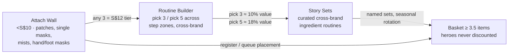

# K-Beauty Assortment Advisory
## Opening range & basket architecture for a Gen Z Asian-beauty retail chain

**Prepared:** 12 Aug 2026 · **Evidence:** Shopee SG Mall harvest (6,353 listings, 79 brands) + iHerb SG K-Beauty harvest (2,738 clean SKUs, 170 brands, full INCI/rank/spec depth) · **Prices:** SGD

---

## 1 · Executive summary

**The thesis: sell routines, not products.** Both channels show the same shape — demand concentrates in serums, masks, cleansers and patches that Gen Z buys *in combination*, and the sellers winning right now are already selling combinations: bundle-titled listings hold **1 in 5 of Shopee's current Top-Sales slots** and carry a **+45% ticket** (S$28.57 vs S$19.74 median) over single units. A chain built on mix-and-match basket value — never single-SKU markdowns — is swimming with this current, not against it.

Six decisions this data supports:

1. **Open with ~250 SKUs across 25–30 brands**, weighted to the routine steps where velocity actually lives: serums/essences (the demand core, ≥98k units/30d on iHerb alone), moisturizers, masks & patches, cleansers.
2. **Anchor on the 44 brands validated on both channels** — COSRX, Anua, SKIN1004, Beauty of Joseon, Medicube, Biodance, TIRTIR, Some By Mi, VT, Mediheal, d'Alba lead the list. Dual-channel presence is the cheapest de-risking you can buy.
3. **Price the core wall at S$15–30.** Median price is almost identical on both channels (S$21.50 Shopee / S$22.18 iHerb) — this band is where Gen Z K-beauty transacts. Reserve <S$10 for the attach wall and >S$40 for a small prestige capsule.
4. **Build the value engine as basket tiers, not discounts** — a Routine Builder (pick-3 / pick-5 across step zones), an attach wall of <S$10 high-velocity items (patches, single-sheet masks, hand/foot masks), and cross-brand ingredient-story sets. Hero prices never move; value is only released when the basket deepens.
5. **Stock the baseline actives as the wall, merchandise the emergent ones as the story.** Hyaluronic acid, niacinamide and centella are table stakes (in 30–50% of all formulas). The heat is in **PDRN, glutathione, tranexamic acid and collagen-film formats** — fewer SKUs, much higher velocity per SKU.
6. **Move fast on a weekly signal loop.** The scrape infrastructure already tracks per-shop Top-Sales rank (refreshed harvests) and iHerb 30-day sold. Buy small, read weekly movers, kill/scale at 30–60–90 days.

---

## 2 · The evidence base

| | Shopee SG (Mall / official stores) | iHerb SG (K-Beauty facet) |
|---|---|---|
| Listings / SKUs | 6,353 (79 brands, 75 shops) | 2,738 clean (170 brands) |
| Sales signal | **Lifetime** sold, bucketed lower bound (≥9.99M units total) | **30-day** sold rate, lower bound (≥372k units/mo across 841 SKUs showing it) |
| Current-demand signal | Per-shop **Top Sales grid rank** on 6,152 listings | **Category best-seller rank** on 94% of SKUs (58 SKUs hold a #1) |
| Depth | Title, price, rating, shelf, breadcrumb | Full **INCI ingredients (99.2%)**, GTIN, specs, price/ml, suggested use |
| Median price | S$21.50 (p25 S$14.18 / p75 S$35.00) | S$22.18 (p25 S$16.28 / p75 S$28.98) |
| Freshness | 4 Aug 2026 | 11 Aug 2026 |

**Read this before comparing channels.** Shopee sold is *cumulative lifetime* (favours older listings); iHerb sold is a *30-day rate*. They must never be ratioed against each other — we use Shopee for "proven at scale" and iHerb for "moving right now", and a SKU that shows on both is the strongest buy signal there is. iHerb only displays sold above a floor (~31% of SKUs show it), so absence means *below the floor*, not zero. 193 iHerb rows whose product pages redirected to non-K-beauty items were detected and excluded from every number in this report.

---

## 3 · Market shape

### 3.1 Where the demand is (category × velocity)

iHerb 30-day units by routine step, with per-SKU velocity — the column that matters for shelf productivity:

| Routine step | SKUs | Units/30d (≥) | Units per SKU | Median price | Read |
|---|---|---|---|---|---|
| Essence / serum / ampoule | 607 | 98,050 | 162 | S$26.10 | **The demand core.** Deepest wall in the store. |
| Moisturizer / cream | 451 | 65,150 | 144 | S$24.70 | Core wall #2. |
| Sheet masks | 208 | 34,050 | 164 | S$21.60 | Splits: multipacks in core, singles (36 SKUs <S$10) on attach. |
| Cleanser (foam/gel) | 179 | 24,200 | 135 | S$19.80 | Routine entry point; gateway SKUs live here. |
| Eye care | 108 | 23,200 | 215 | S$20.90 | Quietly outperforms — under-shopped, high velocity. |
| **Pimple patches** | **33** | **20,300** | **615** | S$15.40 | **Highest velocity per SKU in the dataset.** Small wall, huge traffic. |
| Makeup (colour) | 230 | 18,500 | 80 | S$21.20 | iHerb under-indexes here — see Shopee signal below. |
| Toner | 168 | 18,300 | 109 | S$24.30 | Core; toner *pads* (53 SKUs, S$26.90 med) are the growth format. |
| Sunscreen | 39 | 12,550 | 322 | S$25.30 | Thin supply, strong velocity — stock deeper than the SKU count suggests. |
| Hair & scalp | 101 | 10,550 | 104 | S$19.90 | Real K-beauty adjacency (NARD, Kundal, Dr.FORHAIR). |
| Lip care / tint | 278 | 8,450 | 30 | S$13.90 | Oversupplied on iHerb; on Shopee lip works (Skintific lip serum ≥50k lifetime). Curate hard. |

Mascara deserves a flag: 16 iHerb SKUs move ≥13,350/30d (834/SKU) — Heimish's Dailism mascara alone is ≥10,000/30d at #1. K-beauty colour in *cushion + mascara + tint* form is a real Gen Z lane even though iHerb's catalogue barely carries it.

### 3.2 Brand power (the two leaderboards)

**Shopee lifetime units (proven at scale)** · **iHerb 30-day units (moving now)**

| # | Shopee brand | Lifetime ≥ | | iHerb brand | 30d ≥ | #1 ranks |
|---|---|---|---|---|---|---|
| 1 | cosrx | 1,322,780 | | medicube | 43,250 | 2 |
| 2 | skintific | 812,913 | | pyunkang-yul | 32,400 | 1 |
| 3 | torriden | 705,779 | | vt-cosmetics | 32,300 | 2 |
| 4 | skin1004 | 650,652 | | aplb | 29,750 | 4 |
| 5 | medicube | 559,469 | | cosrx | 28,550 | 2 |
| 6 | vt-cosmetics | 398,207 | | beauty-of-joseon | 23,850 | 3 |
| 7 | some-by-mi | 387,798 | | anua | 19,650 | 2 |
| 8 | nard (hair) | 327,552 | | skin1004 | 19,650 | 2 |
| 9 | grafen (hair) | 282,165 | | heimish | 17,650 | 2 |
| 10 | tirtir | 254,865 | | some-by-mi | 17,150 | 3 |
| 11 | beauty-of-joseon | 248,482 | | dr-althea | 13,200 | 3 |
| 12 | dalba | 231,830 | | petitfee | 11,800 | 3 |

Names appearing high on **both** lists — COSRX, Medicube, VT, SKIN1004, Beauty of Joseon, Some By Mi, Anua (top-20 both sides) — are the anchor roster. Channel-exclusive stars are also signals: **Skintific and Torriden** are Shopee giants absent from iHerb (SEA-native distribution — negotiate direct), while **APLB** (112 SKUs, ≥29,750/30d, 4 category #1s) is an iHerb-native riser most SG retailers haven't shelved yet — a differentiation pick.

### 3.3 Price architecture

Both channels agree on the shape of the money:

- **<S$10 — traffic & attach** (12% of Shopee listings): patches, single masks, mists, hand/foot masks. This is impulse territory — the basket-builder zone.
- **S$10–30 — the transaction core** (56% of Shopee listings; iHerb p25–p75 sits entirely inside it): cleansers, toners, serums, creams, cushions.
- **S$30–50 — considered** (17%): premium serums, devices-adjacent, sets.
- **S$50+ — prestige capsule** (14% of listings, mostly Laneige S$52 med / Sulwhasoo S$146): works at low depth; not the Gen Z engine.

---

## 4 · Trends

### 4.1 Ingredient demand — the wall vs. the story

Mined from the full INCI corpus (2,718 SKUs with ingredients × 30-day sold). **Baseline actives** are ubiquitous — they're the wall, not a differentiator. **Emergent actives** have fewer SKUs but much higher per-SKU heat — they're the endcap story that changes monthly.

| Ingredient family | SKUs carrying it | Units/30d (≥) | Per-SKU heat | Status |
|---|---|---|---|---|
| Hyaluronic acid | 1,361 (50%) | 228,850 | 168 | Baseline — assumed, not advertised |
| Niacinamide | 974 (36%) | 177,900 | 183 | Baseline |
| Centella / cica | 866 (32%) | 122,700 | 142 | Baseline (barrier/calming wall) |
| Collagen | 453 | 96,400 | 213 | **Rising** — film/wrapping mask formats (Biodance, Medicube) |
| Ferments / probiotics | 663 | 90,000 | 136 | Steady (glass-skin narrative) |
| Ceramides | 574 | 80,400 | 140 | Steady (barrier) |
| Peptides | 406 | 69,950 | 172 | Rising (COSRX "6 Peptide Skin Booster" = skin-flooding trend) |
| Rice (oryza) | 309 | 61,650 | 200 | Rising (BOJ halo) |
| Mugwort / green tea / tea tree | ~980 | ~176,000 | 140–210 | Steady calming/oil-control wall |
| Glutathione | 150 | 43,650 | **291** | **Hot** — brightening story (APLB's whole line) |
| BHA (salicylic) | 222 | 40,300 | 182 | Steady (acne wall) |
| Heartleaf (houttuynia) | 198 | 33,450 | 169 | Steady-rising (Anua's identity) |
| Retinol / retinal | 128 | 29,350 | 229 | Rising (BOJ Ginseng+Retinal eye serum = #1 Eye Creams) |
| **PDRN / DNA** | **89** | **28,850** | **324** | **Hottest per SKU** — Medicube PDRN Pink Peptide wave |
| Tranexamic acid | 87 | 21,750 | **250** | Hot (spot-brightening; Anua TXA serum) |
| Snail mucin | 70 | 14,050 | 201 | Icon status — small wall, COSRX essence ≥70k lifetime on Shopee |

**Merchandising translation:** build permanent walls on *calming/barrier* (centella, heartleaf, ceramide, mugwort), *glow* (niacinamide, rice, vitamin C), *acne* (BHA, tea tree, patches). Rotate a monthly "what's new in Seoul" endcap through PDRN → glutathione → tranexamic → collagen-film → peptide-flooding. The heat column says these earn 1.5–2× the per-SKU velocity of the baselines.

### 4.2 Format trends Gen Z is actually buying

- **Collagen film / overnight wrapping masks** — Biodance Real Deep Mask: ≥90k lifetime, its bundle-of-2 is *currently #1* in its shop grid; Medicube Night Wrapping Mask #1 K-Beauty Face Masks.
- **Toner pads** — Mediheal Daily Toner Pad ≥80k lifetime; Medicube Zero Pore Pad 2.0 #1 K-Beauty Toners. Jar formats built for the "prep + pack" ritual.
- **Cushions with shade-range depth** — TIRTIR Mask Fit Red (≥80k, #1 slot), Skintific cushions (≥90k). The Gen Z colour entry point.
- **Spray/mist serums** — d'Alba White Truffle First Spray Serum ≥70k and #1 in-shop.
- **Patches beyond acne** — microdart (Anua Triple Acid), eye hydrogel (Petitfee ≥3k/30d #1 Eye Masks), foot/hand masks (Petitfee foot pack S$2.88, ≥3k/30d).
- **K-hair crossover** — NARD (≥328k lifetime, #1 shampoo slot), Kundal, Dr.FORHAIR, CP-1. A full aisle, not a token shelf.

---

## 5 · The assortment blueprint (~250 SKUs)

### 5.1 Shelf plan by routine step

| Zone | SKUs | Price band | Anchor examples (all verified movers) |
|---|---|---|---|
| Serums & ampoules | 45 | S$20–33 | Torriden DIVE-IN (≥90k), d'Alba spray serum (≥70k), Axis-Y Dark Spot (#1 Brightening), Medicube PDRN Pink, Anua TXA 4, COSRX 6-Peptide, SKIN1004 Centella Ampoule, BOJ Glow Serum (#1 Propolis) |
| Moisturizers & creams | 30 | S$20–32 | Dr. Althea 345 Relief (#1 Moisturizers, S$40.58 — premium end), COSRX Snail 92 Cream, Anua Birch 70 |
| Cleansers | 25 | S$15–24 | COSRX Low pH Good Morning (≥100k, current #1), Anua Heartleaf Quercetinol (#1 Cleansers), April Skin Carrotene (current #1), Heimish All Clean Balm |
| Masks & patches (attach + core) | 35 | S$2.88–28 | COSRX Pimple Patch (≥300k + #1), Biodance film mask, Medicube singles S$3.50, SBM Clear Spot Patch, Petitfee eye/foot |
| Toners & pads | 25 | S$18–30 | Mediheal Toner Pad 2.0 (≥80k), Medicube Zero Pore Pad (#1), Anua Heartleaf 77 |
| Sunscreen | 15 | S$21–30 | BOJ Relief Sun (≥80k), APLB Glutathione SPF50 (#1 Sunscreen), Skintific sun mist (≥70k) |
| Eye care | 12 | S$16–26 | BOJ Revive Eye Serum Ginseng+Retinal (≥10k/30d, #1), Petitfee Gold Hydrogel (#1), Axis-Y Vegan Collagen Eye (#1 Peptide) |
| Colour (cushion-led) | 30 | S$12–30 | TIRTIR Mask Fit Red, Skintific cushions, Heimish mascara (#1), 3CE, Judydoll, Missha brow (S$8.35 attach) |
| Hair & scalp | 15 | S$13–25 | NARD shampoo, Kundal, Dr.FORHAIR Phyto Fresh (current #1), CP-1 treatments |
| Mist / body / foot | 8 | S$3–18 | Enough Collagen Mist S$5.09 (#1 Face Mist), TonyMoly foot peel, Koelf hand/foot masks |
| Discovery & gift kits | 10 | S$13–35 | Idealove variety packs (#1 Gifts), brand starter kits (Celimax Noni kit = current #1 in-shop) |

### 5.2 Brand roster in three tiers

- **Anchors (8–10, ~50% of units):** COSRX · Anua · SKIN1004 · Beauty of Joseon · Medicube · Some By Mi · VT · Biodance · TIRTIR · Mediheal. Every one is top-tier on at least one channel and present on both.
- **Support (10–12):** Torriden, Skintific, d'Alba, Heimish, Pyunkang Yul, Isntree, Dear Klairs, Axis-Y, Dr. Althea, Round Lab, Petitfee, plus hair anchors NARD/Kundal.
- **Emergent rotation (6–8, refreshed quarterly):** APLB (iHerb-native riser), Dr. Melaxin, Numbuzin, mixsoon (current #1 mover), Celimax, TFIT/fwee (colour), Abib. Small buys, fast reads.

---

## 6 · Basket architecture — the value engine

> **Design rule: the price tag never lies.** No single SKU is ever marked down. Value exists only as *basket depth* — the more steps of a routine you build, the better your rate. This protects hero-price integrity with every brand partner, trains members that value = combination, and directly lifts units per transaction.

### 6.1 Why the data says this works

- Bundle-titled listings are already **25.4% of the Shopee Mall assortment**, hold **19.7% of current top-3 Top-Sales slots**, and take **18.6% of all lifetime units** — at a **median ticket of S$28.57 vs S$19.74** for singles (+45%).
- The current #1 movers include *bundles as the hero itself*: Biodance "Bundle of 2 + Serum Duo SET" (#1), Torriden "Bundle of 2" (≥50k), COSRX "3/5/10 Packs" patches (≥80k), Some By Mi "3/5 Packs" spot patch (≥50k). Multi-buy isn't a promo layer on Shopee — it *is* the product.
- The attach math exists at scale: patches average **615 units/SKU/month** on iHerb (highest in the dataset) at S$5–15; 36 sheet-mask SKUs sit under S$10; Enough's S$5.09 mist and Petitfee's S$2.88 foot pack each move ≥3,000/30d.

### 6.2 The three mechanics

**1 · The Attach Wall (traffic → +1 item on every basket).** A permanent fixture at register and queue: COSRX patches (S$4.94), SBM spot patches (S$5.13), Medicube single sheet masks (S$3.50–3.74), Koelf hand/foot masks (S$3.15–3.65), Enough mist (S$5.09), Petitfee foot pack (S$2.88), Nu-Pore strips (S$2.88). Sold flat-price as **"any 3 for S$12 / any 5 for S$18"** — the tier is the only price event.

**2 · The Routine Builder (the core engine).** Every core-wall SKU carries a step tag (Cleanse / Tone / Treat / Moisturize / Protect / Eye). **Pick any 3 steps → bundle price ≈ 10% under the sum; pick 5 → ≈ 18% under.** Cross-brand by design — this is the mix-and-match promise, and it's what no brand's own store can offer. At median step prices (cleanser S$19.80 + toner S$24.30 + serum S$26.10 + moisturizer S$24.70 + SPF S$25.30 = **S$120.20 shelf**), the pick-5 lands at ~**S$99** — a "complete routine under S$100" flagship offer that discounts *nothing* individually.

**3 · Story Sets (the rotation).** Curated cross-brand routines named for the ingredient trend, refreshed with the endcap: *Heartleaf Reset* (Anua cleanser + toner + SBM patch), *Snail Repair* (COSRX essence + cream + Biodance mask), *Glass Skin Flooding* (Torriden serum + COSRX peptide booster + d'Alba mist), *PDRN Glow* (Medicube serum + pink beauty mask + eye patch). Sets carry the pick-3 tier automatically and give TikTok-able names to what the ingredient heat table already shows selling.

### 6.3 Guardrails

- **Hero–halo integrity:** the ~25 hero SKUs (Appendix A) are never in any percentage event; they anchor tiers at full price. Value concentrates on the 2nd–5th items.
- **Tier math over percent-off:** always express as bundle price ("routine for S$99"), never "18% off" — percent language erodes reference prices; bundle language builds routine habit.
- **Floor:** no tier should breach ~22% blended value release; the Shopee evidence shows bundles winning at a +45% *ticket*, not a giveaway margin.
- **Member layer, not markdown layer:** if loyalty is added, deepen tiers for members (pick-5 at 20% equivalent) instead of cutting entry prices.

---

## 7 · Speed playbook

**Days 0–30 — buy the proven.**
Order the anchor roster from the 44 dual-channel brands; SKU-level pick list = the 58 iHerb category #1s + Shopee ≥50k-lifetime movers (Appendix A). Shallow depth (4–6 weeks cover), wide steps. Stand up the Attach Wall and pick-3 tier on day one — it needs no systems beyond POS bundle pricing.

**Days 30–60 — read and rotate.**
The harvest loop already exists: weekly Shopee Top-Sales re-harvest surfaces each shop's current #1s (this week: mixsoon Bean Essence, April Skin Carrotene cleanser, Dr.FORHAIR shampoo, Celimax Noni kit — all new-wave, none yet ubiquitous in SG retail). Add the first emergent-brand buys (APLB, Numbuzin, mixsoon) at test depth. Launch Story Set #1.

**Days 60–90 — kill and scale.**
Rules, not meetings: a SKU below ~50% of its step's median velocity for 6 weeks exits into the next Story Set (clearance-by-bundle, still no markdown); a SKU above 2× step median gets depth + a duo/twin pack (the Torriden/Biodance play). Rotate the endcap active. First seasonal gift kits (Petitfee/Koelf/Idealove pattern) before Q4.

**Cadence thereafter:** weekly movers read → monthly endcap rotation → quarterly roster review (emergent tier in/out). The `market_iherb_products` / `market_brand_*` tools serve all of this on demand, including full ingredient lists for shelf-talker copy and story-set curation.

---

## 8 · Risks & honest caveats

1. **Channel bias.** iHerb skews skincare (colour = 8% of its corpus); the colour/cushion thesis rests on Shopee evidence. Weight accordingly.
2. **Sold figures are lower bounds.** Shopee buckets ("4k+ sold" → 4,000) favour tenured listings; iHerb hides sold below a display floor (31% coverage). Treat every unit figure as ≥, never exact; never compute cross-channel ratios.
3. **SG-priced signals.** Ladder levels transfer as *structure*, not absolute numbers, to other markets.
4. **Freshness window.** Shopee 4 Aug, iHerb 11 Aug 2026. Top-Sales rank is a weekly-moving signal — re-read before the opening buy is committed.
5. **Excluded data.** 193 iHerb rows (6.6%) were redirect-contaminated (discontinued pages bouncing to unrelated products) and are excluded everywhere; the underlying discontinuations also hint those SKUs are exiting iHerb's range.
6. **Coverage.** Shopee harvest covers 79 mall/official brands — the branded K-beauty universe, not all of Shopee. Grey-market resellers (often price-undercutters) are deliberately out of frame; monitor separately if price-matching policy matters.

---

## Appendix A · Hero SKU shortlist (opening buy anchors)

| SKU | Brand | Evidence | Price |
|---|---|---|---|
| Acne Pimple Master Patch | COSRX | ≥300k lifetime · #1 iHerb Beauty Face Masks · ≥10k/30d | S$3.91–4.94 |
| Low pH Good Morning Cleanser | COSRX | ≥100k lifetime · current #1 in-shop | S$4.95–22 |
| Advanced Snail 96 Essence | COSRX | ≥70k lifetime · #1 Snail Skin Care | S$11.51–22.89 |
| 6-Peptide Skin Booster | COSRX | ≥50k lifetime ("skin flooding") | S$16.53 |
| Bio-Collagen Real Deep Mask | Biodance | ≥90k lifetime · duo currently #1 · #1 Collagen | S$18.79–27.35 |
| DIVE-IN Hyaluronic Serum | Torriden | ≥90k lifetime · bundle ≥50k | S$14.38 |
| Mask Fit Red Cushion | TIRTIR | ≥80k lifetime · #1 slot | S$12.60 |
| Daily Toner Pad 2.0 | Mediheal | ≥80k lifetime | S$18.57 |
| Relief Sun Rice + Probiotics | Beauty of Joseon | ≥80k lifetime | S$16.44 |
| Revive Eye Serum Ginseng+Retinal | Beauty of Joseon | ≥10k/30d · #1 Eye Creams | S$23.00 |
| Glow Serum Propolis+Niacinamide | Beauty of Joseon | ≥4k/30d · #1 Propolis | S$26.83 |
| White Truffle First Spray Serum | d'Alba | ≥70k lifetime · #1 slot | S$12.10 |
| Zero Pore Pad 2.0 | Medicube | ≥3k/30d · #1 K-Beauty Toners | S$28.79 |
| PDRN Pink Peptide Serum | Medicube | ≥5k/30d · PDRN wave leader | S$26.82 |
| Beauty-mask singles (Collagen/PDRN/Zero Pore) | Medicube | ≥2k/30d each · S$1.99 Shopee collection ≥70k | S$1.99–3.74 |
| Heartleaf Quercetinol Cleansing Foam | Anua | ≥4k/30d · #1 K-Beauty Cleansers | S$17.31 |
| Niacinamide 10 + TXA 4 Serum | Anua | ≥3k/30d · tranexamic wave | S$36.57 |
| Madagascar Centella Ampoule | SKIN1004 | ≥3k/30d · #3 Centella · ≥650k brand lifetime | S$21.86 |
| Clear Spot Patch | Some By Mi | ≥5k/30d · #1 slot · multipacks ≥50k lifetime | S$5.13–7.77 |
| Dailism Smudge Stop Mascara | Heimish | ≥10k/30d · #1 Mascara | S$15.50 |
| Dark Spot Correcting Glow Serum | Axis-Y | ≥4k/30d · #1 Brightening Serums | S$26.51 |
| Glutathione Niacinamide SPF50 | APLB | ≥7.5k/30d · #1 Sunscreen (differentiation pick) | S$22.18 |
| 345 Relief Cream | Dr. Althea | ≥5k/30d · #1 Moisturizers | S$40.58 |
| Gold Hydrogel Eye Patch (60) | Petitfee | ≥3k/30d · #1 Eye Masks | S$15.64 |
| Shampoo (all hair types) | NARD | ≥50k lifetime · #1 slot (hair aisle anchor) | S$21.57 |

## Appendix B · Reading the numbers

- **"≥" everywhere:** both platforms publish bucketed lower bounds ("4,000+ sold"). True figures are equal or higher.
- **Lifetime vs 30-day:** Shopee = units since listing began; iHerb = units in the trailing 30 days. Different clocks — used side by side, never divided.
- **#1 ranks:** iHerb = category best-seller rank scraped from each product page; Shopee "#1 slot" = first position on that shop's Top-Sales grid at harvest time.
- **Per-SKU heat:** units/30d ÷ SKUs carrying the trait — the shelf-productivity proxy used for trend calls.
- **Source of truth:** all figures queryable live via the Fran MCP (`market_iherb_brands`, `market_iherb_products`, `market_brand_rollup`, `market_brand_compare`), including full INCI lists for any SKU above.
