# Fran’s With Benefits — architecture diagrams

**Status:** Track **L** in `TODO.md` — L-pos / L-skums slice 1 started (2026-07-23); L-base CRM next  
**Date:** 2026-07-17 (arch) · updated 2026-07-23  
**Sources:** `docs/loyaltys.pdf` (FWB mechanics), `docs/HEADLESS_LOYALTY_PROJECT_BRIEF.md`, genesis ownership  

Principles:

1. **Base FWB** = constitution (tiers, expiry, redeem denoms) — rare change.  
2. **Campaigns** = time-boxed overlays — marketer + LLM frequent.  
3. **Agents propose; simulation mandatory; publish gated; runtime never loads red/unsimulated rules.**  
4. **CRM (or headless-loyalty) owns ledger; POS owns checkout UX; SKUMS owns product/sale facts.**

---

## 1. System ownership (who owns what)

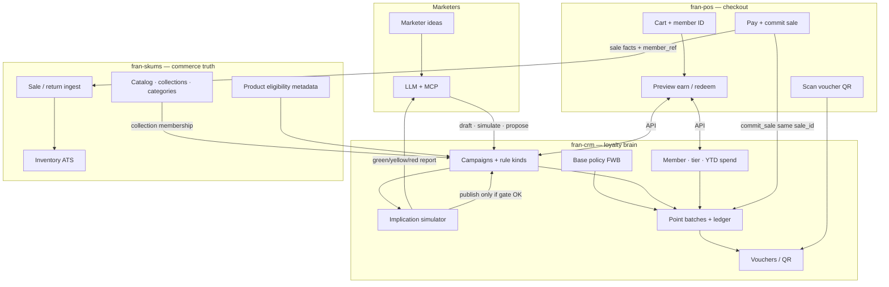

**Not in SKUMS:** points balance SoR, tier jobs, campaign authoring, QR issue.

---

## 2. Agentic campaign airlock (no blind load)

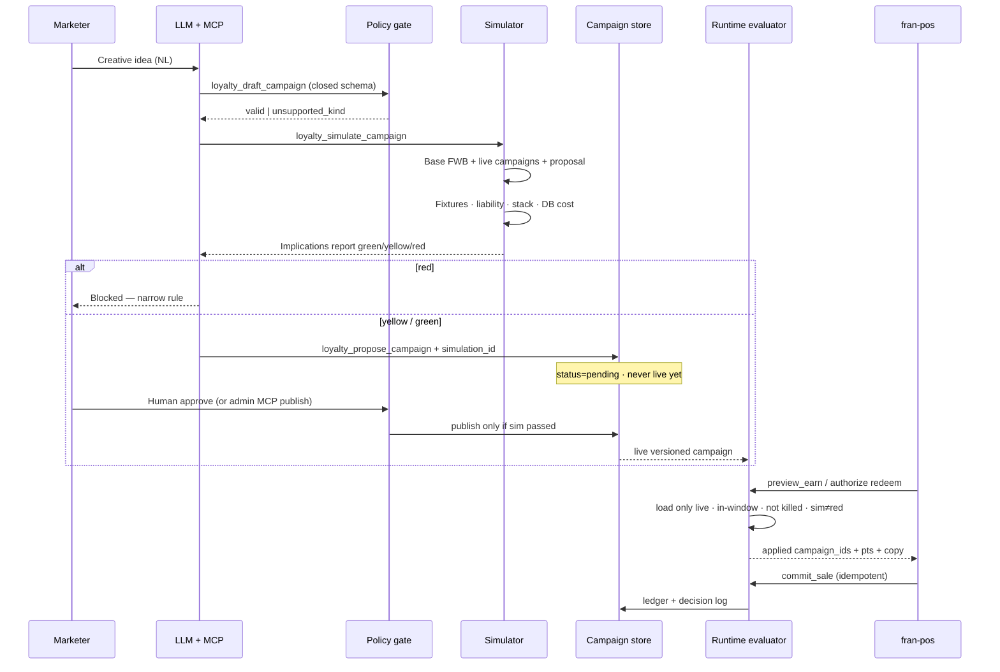

---

## 3. Decision layers (constitution vs campaigns)

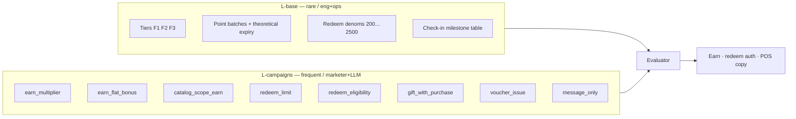

New creative idea → **new parameters on a kind**, or **new kind (eng)**, never free-form code in DB.

---

## 4. Earn evaluation (stacking)

```mermaid
flowchart TD
  Cart[Cart lines + net spend] --> Scope[Match catalog scopes via SKUMS collections]
  Scope --> Base[Base tier rate 1.00 / 1.25 / 1.50]
  Scope --> Camp[Sum matching campaign earn_add]
  Scope --> Vouch[Birthday / category voucher additives if scanned]
  Base --> Sum[Total multiplier]
  Camp --> Sum
  Vouch --> Sum
  Sum --> Cap{Global max rate cap?}
  Cap -->|yes clamp| Floor[floor spend_portion × rate]
  Cap -->|no| Floor
  Floor --> Batch[Credit point batch<br/>earn_date · quarter · theoretical_expiry]
  Batch --> Log[Runtime decision log<br/>campaign_ids[]]
```

PDF-aligned: birthday and category each contribute **+1.00** when active; campaigns add within stack rules and hard caps.

---

## 5. Implication report (three axes)

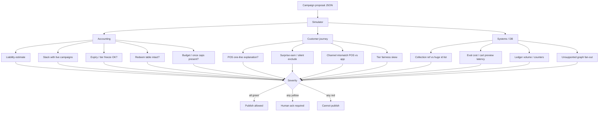

---

## 6. Logging (three append-only streams)

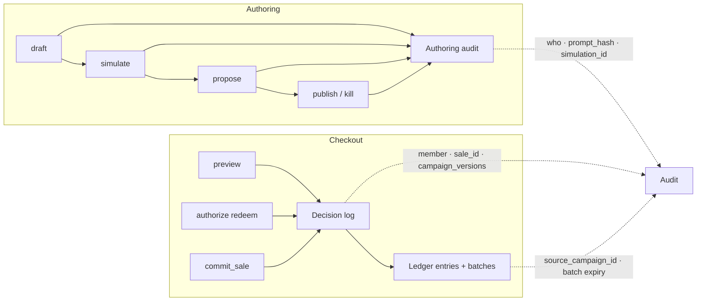

**Debug path:** “Why 875 pts?” → decision log → campaign versions + base tier → batches.

---

## 7. Catalog targeting (marketer collections)

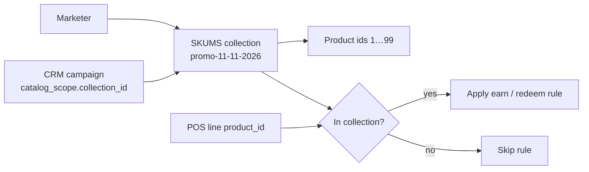

Prefer **collection id** over dumping thousands of product ids into the campaign row.

---

## 8. Runtime load filter (never blind)

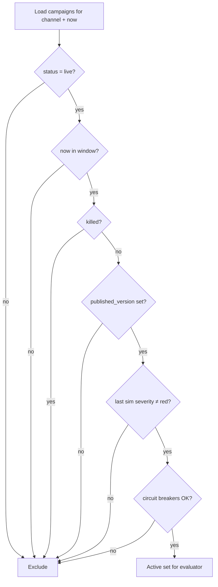

---

## 9. Point batch lifecycle (PDF expiry × campaigns)

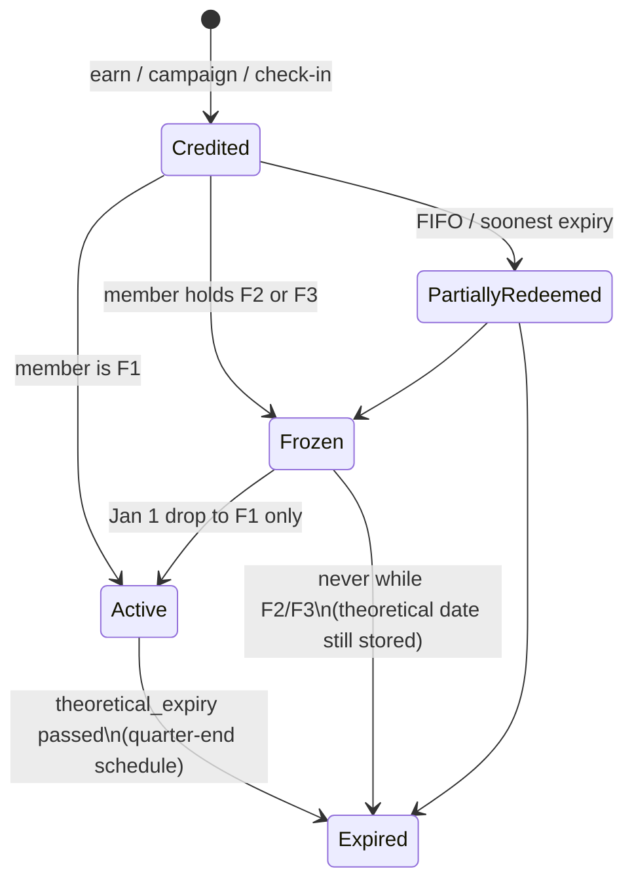

Campaigns **create** batches with the same tagging rules; they must **not** rewrite theoretical_expiry.

---

## 10. MCP tool surface (loyalty)

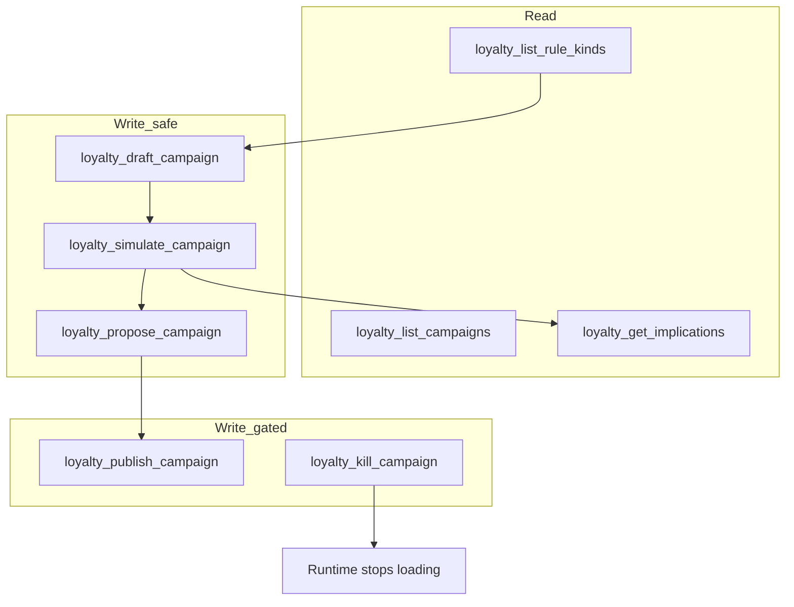

| Scope | Tools |
|-------|--------|
| `loyalty:read` | list / get implications |
| `loyalty:draft` | draft |
| `loyalty:simulate` | simulate |
| `loyalty:propose` | propose pending |
| `loyalty:publish` | publish (admin / human; not default cloud agent) |
| `loyalty:kill` | emergency off |

---

## 11. End-to-end happy path (one diagram)

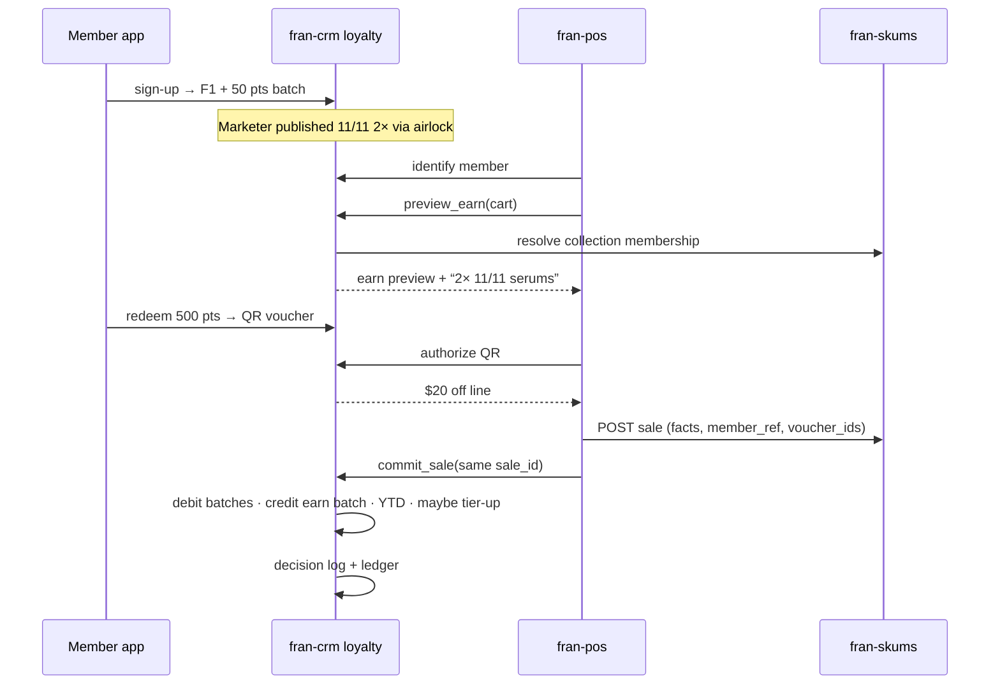

---

## 12. Track L slice map (for later TODO)

```mermaid
gantt
  title Track L — suggested order (relative)
  dateFormat X
  axisFormat %s

  section Base
  L-base FWB ledger + PDF golden tests     :a1, 0, 3
  section Campaigns
  L-kinds closed rule kinds + evaluator    :a2, 2, 3
  L-sim implications + fixtures            :a3, 4, 3
  L-mcp draft/sim/propose · publish gated  :a4, 6, 2
  L-admin UI kill audit                    :a5, 7, 2
  section Channels
  L-pos preview commit                     :a6, 5, 3
  L-skums collections + sale contract      :a7, 3, 3
```

---

## Related files

| File | Role |
|------|------|
| `docs/loyaltys.pdf` | FWB business rules |
| `docs/HEADLESS_LOYALTY_PROJECT_BRIEF.md` | Optional separate loyalty service |
| `genesis.md` | Ownership boundaries |
| `fran-pos/LOYALTY_POLICY_EXECUTION_PLAN.md` | POS policy evaluator notes |
